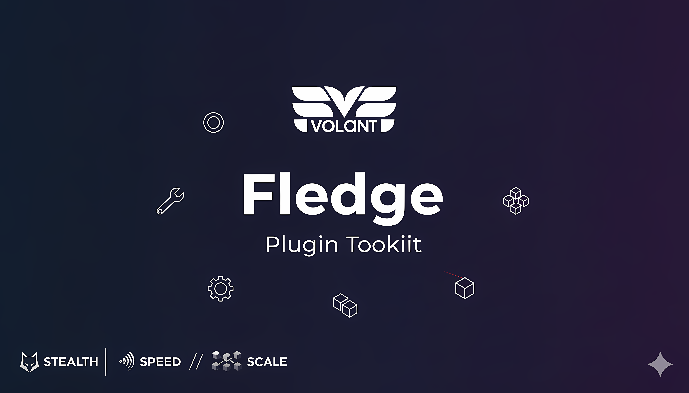

<p align="center">
  
</p>

<p align="center">
  <a href="https://github.com/volantvm/fledge/actions"></a>
  <a href="https://github.com/volantvm/fledge/releases"></a>
  
  
</p>

---

# Fledge

**Volant Plugin Builder**

Fledge is the plugin builder, the toolkit for creating the boot artifacts referenced in Volant plugins.
It helps to streamline the process of building either an initramfs with your own payload(preferably a static binary), or a rootfs from a Docker image, which also supports injecting your own payload.

The recipe for building your artifact is defined in a `fledge.toml` file.
There are two kinds of configuration files for Volant plugins: `manifest.json` and `fledge.toml`

This guide is focused on the 'fledge.toml' configuration file, as this repository is focused on the stage of building the artifact.
If you are looking for the 'manifest.json' configuration file, meaning if you do not intend to build the artifact yourself and only want to install a pre-made plugin, please refer to [initramfs-plugin-example](https://github.com/volantvm/initramfs-plugin-example)(caddy) or [oci-plugin-example](https://github.com/volantvm/oci-plugin-example)(nginx)


Let's get started on building the artifact.

---

## Quick Start

```bash
# Install
curl -LO https://github.com/volantvm/fledge/releases/latest/download/fledge-linux-amd64
chmod +x fledge-linux-amd64 && sudo mv fledge-linux-amd64 /usr/local/bin/fledge
```

### Build an OCI-based plugin

Fledge uses two configuration files:
- **`fledge.toml`** - Build-time config (image source, filesystem type, agent sourcing)
- **`manifest.toml`** - Runtime defaults (CPU, memory, workload, network)

```bash
# fledge.toml - Build configuration
cat > fledge.toml <<'EOF'
version = "1"
strategy = "oci_rootfs"

[agent]
source_strategy = "release"
version = "latest"

[source]
image = "nginx:alpine"

[filesystem]
type = "squashfs"           # Default
compression_level = 15      # 1-22, balanced compression
overlay_size = "1G"         # tmpfs for runtime writes
EOF

# manifest.toml - Runtime defaults
cat > manifest.toml <<'EOF'
schema_version = "v1"
name = "nginx"
version = "1.0.0"
runtime = "nginx"

[resources]
cpu_cores = 2
memory_mb = 512

[workload]
entrypoint = "/usr/sbin/nginx"
args = ["-g", "daemon off;"]

[network]
mode = "bridged"

[[network.expose]]
port = 80
protocol = "tcp"
EOF

sudo fledge build --config fledge.toml --manifest manifest.toml
# → outputs nginx-rootfs.img + nginx.manifest.json
```

### Build from a Dockerfile (OCI rootfs)

```bash
# fledge.toml
cat > fledge.toml <<'EOF'
version = "1"
strategy = "oci_rootfs"

[agent]
source_strategy = "release"
version = "latest"

[source]
dockerfile = "./Dockerfile"
context = "."            # optional; defaults to Dockerfile's directory
target = ""              # optional multi-stage target
build_args = { FOO = "bar" }

[filesystem]
type = "squashfs"           # Default
compression_level = 15      # 1-22, balanced compression
overlay_size = "1G"         # tmpfs for runtime writes
EOF

# manifest.toml
cat > manifest.toml <<'EOF'
schema_version = "v1"
name = "myapp"
version = "1.0.0"
runtime = "myapp"

[resources]
cpu_cores = 1
memory_mb = 256

[workload]
entrypoint = "/app/server"

[network]
mode = "bridged"
EOF

sudo fledge build --config fledge.toml --manifest manifest.toml
```

Notes:
- `source.image` or `source.dockerfile` may be provided (mutually exclusive)
- `build_args` are passed through to `docker build`
- Ephemeral images/tags created during the build are cleaned up automatically

### Build directly from a Dockerfile (no fledge.toml)

```bash
sudo fledge build ./Dockerfile
# → outputs <directory>.img + <directory>.manifest.json
```

Flags available in direct-build mode:
- `--context` — override the build context directory (defaults to the Dockerfile's directory)
- `--target` — select a multi-stage build target
- `--build-arg KEY=VALUE` — pass one or more build arguments
- `--output` — rename the resulting artifact
- `--output-initramfs` — produce an initramfs (`.cpio.gz`) instead of a rootfs image

### Install and run it

```bash
volar plugins install --manifest nginx.manifest.json
volar vms create web --plugin nginx
```

Boots a real VM—networked, isolated, live in seconds.

---

## Embedded BuildKit (default)

Fledge now uses an embedded BuildKit solver by default (no external buildkitd). This path is Linux-only and runs build steps inside Cloud Hypervisor microVMs.

Environment variables:
- `CLOUDHYPERVISOR` — path to the `cloud-hypervisor` binary (default: `cloud-hypervisor` in PATH)
- `FLEDGE_KERNEL_BZIMAGE` — path to bzImage (compressed, default: `/var/lib/volant/kernel/bzImage`)
- `FLEDGE_KERNEL_VMLINUX` — path to vmlinux (uncompressed ELF, default: `/var/lib/volant/kernel/vmlinux`)

Switching modes:
- Embedded (default): no env required
- External daemon: set `FLEDGE_BUILDKIT_MODE=daemon` and point to your buildkitd via `FLEDGE_BUILDKIT_ADDR` if needed

Note: On non-Linux platforms, the embedded path is not available; use the external daemon mode instead.

---

## Build Strategies

| Strategy | When to Use | Output | Typical Size |
|-----------|--------------|---------|---------------|
| **OCI Rootfs** | Existing Docker/OCI images | `.img` + manifest | 50 MB–2 GB |
| **Initramfs** | Custom apps / stateless services | `.cpio.gz` + manifest | 5–50 MB |

---

## Minimal Initramfs Example

```toml
# fledge.toml - Build configuration
version = "1"
strategy = "initramfs"

[agent]
source_strategy = "release"
version = "latest"

[source]
# Busybox is optional; defaults to a pinned musl static busybox if omitted
# busybox_url = "https://busybox.net/downloads/binaries/1.35.0-x86_64-linux-musl/busybox"
# busybox_sha256 = "6e123e7f3202a8c1e9b1f94d8941580a25135382b99e8d3e34fb858bba311348"

[mappings]
"./myapp" = "/usr/bin/myapp"
```

```toml
# manifest.toml - Runtime defaults
schema_version = "v1"
name = "myapp"
version = "1.0.0"
runtime = "myapp"

[resources]
cpu_cores = 1
memory_mb = 128

[workload]
entrypoint = "/usr/bin/myapp"

[network]
mode = "vsock"
```

```bash
sudo fledge build --config fledge.toml --manifest manifest.toml
volar images install --manifest myapp.manifest.json
volar vms create demo --image myapp
```

### Initramfs from a Dockerfile (overlay → busybox → kestrel/init)

```toml
# fledge.toml
version = "1"
strategy = "initramfs"

[agent]
source_strategy = "release"
version = "latest"

[source]
dockerfile = "./Dockerfile"
context = "."
# optional: busybox_url / busybox_sha256 (defaults applied if omitted)

[mappings]
"./myapp" = "/usr/bin/myapp"
```

```toml
# manifest.toml
schema_version = "v1"
name = "myapp"
version = "1.0.0"
runtime = "myapp"

[resources]
cpu_cores = 2
memory_mb = 512

[workload]
entrypoint = "/usr/bin/myapp"
args = ["--port", "8080"]

[network]
mode = "bridged"

[[network.expose]]
port = 8080
protocol = "tcp"
```

Notes:
- If `busybox_url` is omitted, a pinned musl-static BusyBox is injected by default
- The built image filesystem is overlaid into the initramfs before adding Kestrel/init (Mode 1)

---

## Configuration Reference

Fledge uses two separate configuration files to maintain clean separation between build-time and runtime concerns:

### fledge.toml Reference (Build-Time Configuration)

This file contains **only build-time settings** - how to build the artifact.

| Section | Example | Purpose |
|---------|---------|---------|
| Top-level | `version = "1"`, `strategy = "oci_rootfs"` | Required metadata |
| `[agent]` | `source_strategy = "release"`, `version = "latest"` | Kestrel agent source. Required for `oci_rootfs`. Used for `initramfs` default mode (omit `[init]`). Not allowed with `[init] path=...` or `[init] none=true`. |
| `[source]` | `image = "nginx:alpine"` or `dockerfile = "./Dockerfile"` (+ `context`, `target`, `build_args`) for image input; `busybox_url`/`busybox_sha256` optional for initramfs (defaults applied) | Build input |
| `[filesystem]` | `type = "squashfs"` (default), `compression_level = 15`, `overlay_size = "1G"` | Required for `oci_rootfs`; ext4/xfs/btrfs available as legacy options |
| `[init]` | `path = "/usr/local/bin/my-init"` or `none = true` | Initramfs only; choose custom init or no wrapper |
| `[mappings]` | `"local" = "/dest"` | Optional file/directory mappings |

Note on agent requirements:
- OCI Rootfs: `[agent]` is required.
- Initramfs default (no `[init]`): Kestrel is used; `[agent]` can be specified explicitly or defaulted to `source_strategy = "release"`, `version = "latest"`.
- Initramfs with `[init] path=...` or `[init] none=true`: Do not include `[agent]` (Kestrel is not used).

### manifest.toml Reference (Runtime Defaults Configuration)

This file contains **runtime defaults** - how the image should run by default in Volant.

| Section | Example | Purpose |
|---------|---------|---------|
| Top-level | `schema_version = "v1"`, `name = "nginx"`, `version = "1.0.0"`, `runtime = "nginx"` | Required metadata |
| `[resources]` | `cpu_cores = 2`, `memory_mb = 512` | Default CPU and memory allocation |
| `[workload]` | `entrypoint = "/usr/sbin/nginx"`, `args = ["-g", "daemon off;"]` | Default entrypoint and arguments |
| `[network]` | `mode = "bridged"`, `expose = [{ port = 80, protocol = "tcp" }]` | Network mode and exposed ports |
| `[env]` | `LOG_LEVEL = "info"`, `WORKERS = "4"` | Default environment variables |
| `[actions]` | Custom API actions (advanced) | Plugin-specific actions |

**Note:** These defaults can be overridden at VM creation time via `volar vms create` flags.

### Generated Output: manifest.json

Fledge automatically merges `manifest.toml` (runtime defaults) with build metadata (artifact URL, checksum, format) to generate `manifest.json`, which is published alongside your artifact.

---

## Init Modes

Fledge supports three init modes for initramfs. See [docs/init-modes.md](docs/init-modes.md) for complete details.

**The Ladder of Laziness:**
1. **Default (no `[init]` section)** — Batteries-included: C init + Kestrel agent (90% of users)
2. **Custom (`[init] path = "..."`** — C init + your custom init script
3. **No wrapper (`[init] none = true`)** — Your binary is PID 1 (maximum performance)

**Examples:**
- [Mode 1: Default](docs/examples/mode1-default.toml)
- [Mode 2: Custom Init](docs/examples/mode2-custom-init.toml)
- [Mode 3: No Init](docs/examples/mode3-no-init.toml)

---

## Tips

- **Static binaries** for initramfs (`CGO_ENABLED=0`)
- **Verify checksums** on downloads
- **Keep it small** (< 100 ms boots)
- **Use OCI** for heavy dependencies

---

## Troubleshooting

| Issue | Fix |
|-------|-----|
| `must run as root` | `sudo fledge build` |
| Missing `skopeo` | `sudo apt install skopeo` |
| Slow builds | Smaller base images / `preallocate=true` |
| Loop device errors | `sudo modprobe loop` then retry |

---

## License

**Business Source License 1.1**

- Free for plugin development and evaluation
- Commercial use requires a license
- Converts to Apache 2.0 on Oct 4 2029

See [LICENSE](LICENSE) for details.

---

**© 2025 HYPR PTE. LTD.**
